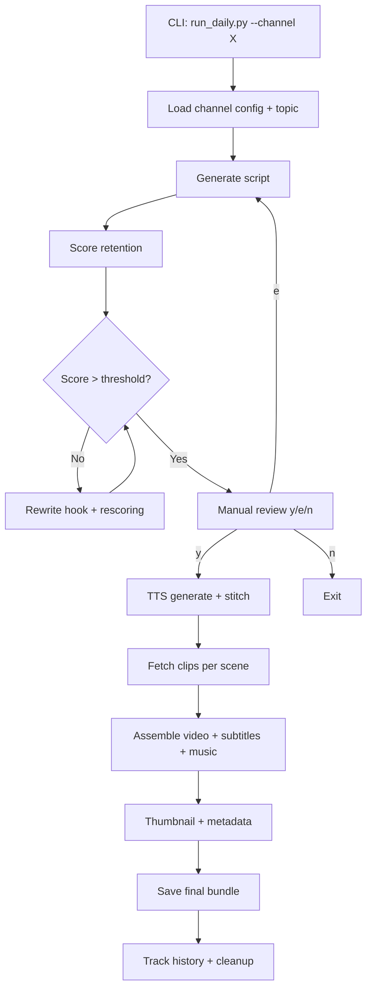
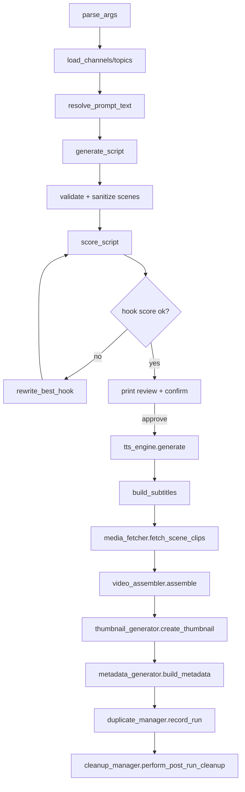

# Shorts Factory (YouTube Shorts Automation)

Generates higher-quality shorts with:
- richer Hindi/regional scripts
- automatic ChatGPT-generated content prompt per run (fresh variation each time)
- cinematic scene prompt planning per subtitle segment
- visual providers (Pexels/Pixabay) with fallback
- audio modes: `voice`, `music`, `both`
- script review before generation (to avoid wasting API credits)
- automatic Hindi voice quality scoring and retry across configured Hindi voices
- automatic Hindi pronunciation cleanup for mixed English words/acronyms before TTS

## Setup

```bash
brew install ffmpeg
python3 -m venv .venv
source .venv/bin/activate
pip install -r requirements.txt
cp .env.example .env
chmod 600 .env
```

Fill `.env` (gitignored):
- `ELEVENLABS_API_KEY`
- `OPENAI_API_KEY` (for automatic ChatGPT prompt generation)
- `PEXELS_API_KEY`
- `PIXABAY_API_KEY`
- optional: `ELEVENLABS_VOICE_ID_HI`, `ELEVENLABS_VOICE_ID_EN`
- optional: `ELEVENLABS_VOICE_IDS_HI` (comma-separated fallback list)
- optional: `ELEVENLABS_MAX_RETRIES` (default: `2`)
- optional: `OPENAI_MODEL` (default: `gpt-4o-mini`)
- optional: `OPENAI_PROMPTS_ENABLED` (default: `1`)

Key-handling notes:
- Keep secrets only in `.env` or shell env; never hardcode in code/files.
- Canonical keys used by the app: `OPENAI_API_KEY`, `ELEVENLABS_API_KEY`, `PEXELS_API_KEY`, `PIXABAY_API_KEY`.
- Supported aliases are auto-mapped to canonical names at runtime:
  - `CHATGPT_API_KEY -> OPENAI_API_KEY`
  - `XI_API_KEY -> ELEVENLABS_API_KEY`
- The app checks `.env` file permissions and warns if too broad (recommended: `chmod 600 .env`).

## Single Command (4 styles)

```bash
./generate_all.sh sonbhadra
```

Optional audio mode in batch:

```bash
AUDIO_MODE=both BGM_PATH=shorts_factory/assets/music/bg.mp3 ./generate_all.sh bihar
```

## Main Command

```bash
.venv/bin/python -m shorts_factory.src.main \
  --channel "UP-Bihar Shorts" \
  --style regional \
  --region bihar \
  --voice-lang hi \
  --ai-visuals \
  --audio-mode both \
  --bg-music shorts_factory/assets/music/bg.mp3 \
  --voice-volume 1.0 \
  --bgm-volume 0.18
```

## Credit-Safe Review Flow

Preview/edit script intent before any TTS/API call:

```bash
.venv/bin/python -m shorts_factory.src.main --channel "Test" --style regional --region bihar --content-prompt "local jobs and youth" --review-only
```

Approval step before generation:

```bash
.venv/bin/python -m shorts_factory.src.main --channel "Test" --style regional --region bihar --content-prompt "local jobs and youth" --review-script --ai-visuals
```

## Key Options

- `--content-prompt "..."` customizes script direction
- `--review-only` shows script and exits (no credit usage)
- `--review-script` asks approval before generation
- `--audio-mode voice|music|both`
- `--bg-music <path>` background music file
- `--voice-volume` and `--bgm-volume` adjust mix balance
- `--with-srt` writes subtitle sidecar (off by default)

## Cleanup Script

Use this anytime before commit or before a fresh run:

```bash
./clean_workspace.sh --runtime
```

Or via make:

```bash
make clean
```

Dry-run first:

```bash
./clean_workspace.sh --runtime --dry-run
```

Deep clean (also removes cache/pycache/temp):

```bash
./clean_workspace.sh --all
make clean-all
```

What it cleans:
- `daily_shorts/output`, `daily_shorts/logs`, `daily_shorts/final`, `daily_shorts/assets/cache`
- `shorts_factory/output`, `shorts_factory/logs`, `shorts_factory/audio`
- `.DS_Store`, `*.tmp`, `*.temp`

## Output Policy

Default cleanup keeps workspace minimal.
Generated outputs are:
- `shorts_factory/output/*.mp4`
- `shorts_factory/audio/*.mp3` (for voice/both modes)

No script/log/cache persistence by default.

## Saved Prompt Templates
- Generic templates are saved at `shorts_factory/templates/generic_prompt_templates.md`.

## HLD (High-Level Design)

Main modules:
- `run_daily.py`: Orchestration + review gate + logging + cleanup
- `core/script_generator.py`: Script generation (OpenAI + local fallback)
- `core/retention_scorer.py` + `core/hook_rewriter.py`: Retention scoring + hook improvement
- `core/tts_engine.py`: Scene-wise TTS, stitching, duration handling
- `core/media_fetcher.py`: Scene media lookup (Pixabay -> Pexels -> fallback clip)
- `core/video_assembler.py`: 1080x1920 video assembly, subtitles, audio mix
- `core/thumbnail_generator.py`: Thumbnail from rendered frame
- `core/metadata_generator.py`: SEO metadata JSON
- `core/duplicate_manager.py`: Topic/keyword/repetition memory
- `core/cleanup_manager.py`: Post-run artifact cleanup

High-level flow:


## LLD (Low-Level Design)

Detailed runtime sequence:

